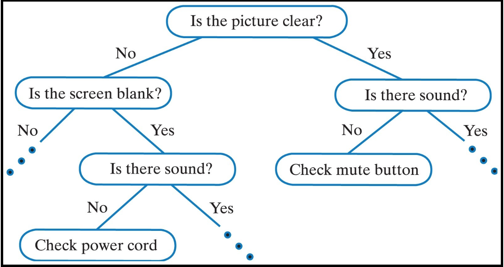
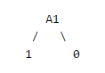

# CS 3600: Artificial Intelligence - Assignment 4 - Decision Trees and Forests

## Setup
For this assignment, you will need Numpy, No other external libraries are allowed for solving this problem.

Please use the same environment from previous assignments by running

```
conda activate ai_env
```

If you wish to run the supplementary testing notebook, you will need jupyter installed. You may then call the following command from your downloaded repository, and select unit_testing.ipynb:

```
jupyter notebook
```

If you wish to run the supplementary Helper notebook to visualize Decision tree, you will need to install graphviz library. Call the following command after your activate your conda environment:

```
pip install graphviz==0.19.1
```

Alternatively, you can simply run the below from your downloaded repository:

```
pip install -r requirements.txt
```
If you have difficulty or errors on graphviz=0.19.1
From your ai_env Terminal:
```
conda install -c conda-forge python-graphviz 
```
which installs version 0.19 (compatible)

## Overview
<!-- Machine learning offers a number of methods for classifying data into discrete categories, such as k-means clustering. Decision trees provide a structure for such categorization, based on a series of decisions that led to separate distinct outcomes. In this assignment, you will work with decision trees to perform binary classification according to some decision boundary. Your challenge is to build and to train decision trees capable of solving useful classification problems. You will learn first how to build decision trees, then how to effectively train them and finally how to test their performance. -->
Machine Learning is a subfield of AI, and Decision Trees are a type of Supervised Machine Learning. In supervised 
learning an agent will observe sample input and output and learn a function that maps the input to output. The function
is the hypothesis ''' y = f(x)'''. To test the hypothesis we give the agent a *test set* different than the training 
set. A hypothesis generalizes well if it correctly predicts the y value. If the value is *finite*, the problem is a 
*classification* problem, if it is a *real number* it is considered a *regression* problem.
When a classification problem has exactly two values (+,-) it is a Binary Classification. When there are more than 
two values it is called Multi-class classification. Decision trees are relatively simple but highly successful types 
of supervised learners. Decision trees take a vector of attribute values as input and return a decision. 
[Russell, Norvig, AIMA 3rd Ed. Chptr. 18]

<p>



## Submission and Due Date

The deliverable for the assignment is a **_submission.py_** upload to Gradescope.

* All functions to be completed in **_submission.py_**

**Important**:
Submissions to Gradescope are rate limited for this assignment. **You can submit two submissions every 60 minutes during the duration of the assignment**.

<!-- In your Gradescope submission history, you can mark a certain submission as 'Active'. Please ensure this is your best submission. -->

Since we want to see you innovate and imagine new ways to do this, we know this can also cause you to fail 
(spectacularly in my case) For that reason you will be able to select your strongest submission to Gradescope. 
In your Gradescope submission history, you will be able to mark your best submission as 'Active'. 
This is a students responsibility and not faculty.
### The Files

You will only have to edit and submit **_submission.py_**, but there are a number of notable other files:
1. **_submission.py_**: Where you will build your decision tree, confusion matrix, performance metrics, forests, and do the vectorization warm up.
2. **_decision_trees_submission_tests.py_**: Sample tests to validate your trees, learning, and vectorization locally.
3. **_visualize_tree.ipnb_**: Helper Notebook to help you understand decision trees of various sizes and complexity
4. **_unit_testing.ipynb_**: Helper Notebook to run through tests sequentially along with the readme

## Resources
* Canvas *Thad's Videos*: [Lesson 7, Machine Learning](https://gatech.instructure.com/courses/225196/modules/items/2197076)
* Textbook:Artificial Intelligence Modern Approach 
  * Chapter 18 Learning from Examples
  * Chapter 20 Learning Probabilistic Models
* [Cross-validation](https://en.wikipedia.org/wiki/Cross-validation_(statistics))
* [K-Fold Cross-validation](http://statweb.stanford.edu/~tibs/sta306bfiles/cvwrong.pdf)


### Decision Tree Datasets
1. **_part23_data.csv_**: 4 features, 1372 data points, binary classification The label for each datapoint is in the *last* column.
2. **_challenge_train.csv_**:  30 features, 6636 datapoints, binary classification. The label for each datapoint is in the *first* column.
3. **_mod_complex_binary.csv_**: 7 features, 1400 examples, binary classification (last column)
#### Warmup Data
4. **_vectorize.csv_**: data used during the vectorization warmup for Assignment 4

NOTE: path to the datasets! './data/your_file_name.csv'

### Imports
**NOTE:** We are only allowing four imports: numpy, math, collections.Counter and time. We will be checking to see if any other libraries are used. You are not allowed to use any outside libraries. Please remember that you should not change any function headers.

#### Rounding
**NOTE:** Although your local tests will have some rounding, it is meant to quickly test your work. Overall this 
assignment follows the CS 6601 norm of rounding to 6 digits. If in doubt, in use round:</br>
```
x = 0.12345678
round(x, 6)
Out[4]: 0.123457
```
---

### Part 0: Vectorization!
_[10 pts]_

* File to use: **_vectorize.csv_**

Vectorization is a process that provides enormous performance increases when processing large amounts of data. Whether one is training a deep neural network on millions of images, building random forests over a large dataset, or utilizing other algorithms, machine learning makes _extensive_ use of vectorization. In python, the **numpy** package provides a programmer with the ability to use python-wrapped, low-level optimizations written in C. However, the technique may feel strange at first and requires some practice to use comfortably.

The data management in Assignment 4 can benefit from familiarity with these techniques. Additionally, Assignment 4 has a vectorization requirement so that it can run within a reasonable time limit. This small section will hopefully introduce you to vectorization and some of the cool tricks you can use in python. We encourage you to use any numpy function out there (on good faith) to do the functions in the warmup section.

For the five functions that we have, we are testing your code based on how fast it runs. It will need to beat the non-vectorized code to get full points.

TAs will offer little help on this section. This section was created to help get you ready for this and other assignments; 
feel free to ask other students on Ed Discussion or use some training resources. (e.g. https://numpy.org/learn/)


How grading works:
1. We run the non-vectorized code and your vectorized code 500 times, as long as the average time of your vectorized code is less than the average time of the non-vectorized code, you will get the points (given that your answer is correct).

#### Functions to complete in the `Vectorization` class:
1. `vectorized_loops()`
2. `vectorized_slice()`
3. `vectorized_flatten()`
4. `vectorized_glue()`
5. `vectorized_mask()`

---


## The Assignment
Classification is used widely in machine learning to figure out how to sort new data that comes through.  You will build, train and test decision tree models to perform basic classification tasks. Students should understand how decision trees and random forests work. This will help you develop an intuition for how and why accuracy differs for training and testing data based on different parameters.

### Assignment Introduction
For this assignment we're going to need an explicit way to make structured decisions. The `DecisionNode` class will be used to represent a decision node as some atomic choice in a binary decision graph. We will only use this implementation of the Decision Tree for this assignment and any other implementations will be checked against and denied credit.

<!-- An object from the 'DecisionNode' can represent a class label (i.e. a final decision) or a binary decision to guide us through a flow-chart to arrive at a decision. Note that in this representation 'True' values for a decision take us to the left. This choice is arbitrary, but this is used in the hint below. -->

An object of type 'DecisionNode' can represent a 
* decision node
  * *left*: will point to less than or equal values of the split value, type DecisionNode, True evaluations
  * *right*: will point to greater than values of the split value, type DecisionNode, False evaluations
  * *decision_function*: evaluates an attribute's value and maps each vector to a descendant
  * *class_label*: None
* leaf node
    * *left*: None
    * *right*: None
    * *decision_function*: None
    * *class_label*: A leaf node's class value
* Note that in this representation 'True' values for a decision take us to the left. This choice is arbitrary, but this is used in the hint below.
---

### Part 1a: Building a Binary Tree by Hand
_[15 Pts]_

In `build_decision_tree()`, construct a tree of decision nodes by hand in order to classify the data below, i.e. map each datum **x** to a label **y**.  Your tests should use as few attributes as possible. Break ties among tests with the same number of attributes by selecting the one that classifies the greatest number of examples correctly. If multiple tests have the same number of attributes and classify the same number of examples, then break the tie using attributes with lower index numbers (e.g. select **A1** over **A2**)
<p>

| Datum	| A1  | A2  | A3  | A4  |  y  |
| ----- | --- | --- | --- | --- | --- |
| x1    |  1  |  0  |  0  |  0  |  1  |
| x2    |  1  |  0  |  1  |  1  |  1  |
| x3    |  0  |  1  |  0  |  0  |  1  |
| x4    |  0  |  1  |  1  |  0  |  0  |
| x5    |  1  |  1  |  0  |  1  |  1  |
| x6    |  0  |  1  |  0  |  1  |  0  |
| x7    |  0  |  0  |  1  |  1  |  1  |
| x8    |  0  |  0  |  1  |  0  |  0  |

#### Requirements:
The total number of elements(nodes, leaves) in your tree should be < 10.


#### Hints:
To get started, it might help to **draw out the tree by hand** with each attribute representing a node.

To create the decision function that will be passed to `DecisionNode`, you can create a lambda expression as follows:

    func = lambda feature : feature[2] == 0

This will choose the left node if the third attribute is 0.

For example, a tree looks like this:

> Lets say if A1==0 then class would be 1; else class would be 0. This node can be represented by:
> <p>
> 

You would write your code like this:

    decision_tree_root = DecisionNode(None, None, lambda a1: a1 == 0)
    decision_tree_root.left = DecisionNode(None, None, None, 1)
    decision_tree_root.right = DecisionNode(None, None, None, 0)

    return decision_tree_root

#### Functions to complete in the `submission` module:
1. `build_decision_tree()`

---

### Part 1b: Precision, Recall, Accuracy and Confusion Matrix
_[12 pts]_

Now that we have a decision tree, we're going to need some way to evaluate its performance. In most cases we would reserve a portion of the training data for evaluation, or use cross-validation. 

Your confusion matrix should be K x K, K = number of classes. In the binary case, K = 2. Actual labels (true labels) of the dataset will be represented by the rows, and the predicted labels form the columns. Notice that the correct classifier predictions form the diagonal of the matrix. True positives are samples where the prediction matches the true label, false positives are samples that were predicted positive, but are actually negative. False negatives are samples that were predicted negative, but were actually positive, whereas true negatives were predicted negative and are negative. It will be very helpful to use the numpy diag (or diagonal) function in this part of the assignment. You will have to consider carefully by class what the diagonal value tells you, what its row tells you, what its column tells you, and what is left?

    * Accuracy: Of all the examples, what percentage did my classifier predict correctly?
    * Precision: How often is my classifier right when it makes a positive prediction?
    * Recall: How often does my classifier recognize positive examples? 
    
Fill out the methods to compute the confusion matrix, accuracy, precision and recall for your classifier output. classifier_output will be the labels that your classifier predicts, while the true_labels will be the true test labels. Helpful references:


  * Wikipedia: (https://en.wikipedia.org/wiki/Confusion_matrix)
  * Metrics for Multi-Class Classification: (https://arxiv.org/pdf/2008.05756.pdf)
  * Performance Metrics for Activity Recognition Sec 5: (https://www.nist.gov/system/files/documents/el/isd/ks/Final_PerMIS_2006_Proceedings.pdf#page=143)


If you want to calculate the example set above by hand, run the following code.

    classifier_output = [decision_tree_root.decide(example) for example in examples]

    p1_confusion_matrix = confusion_matrix(classifier_output, classes)
    p1_accuracy = accuracy( classifier_output, classes )
    p1_precision = precision(classifier_output, classes)
    p1_recall = recall(classifier_output, classes)

    print p1_confusion_matrix, p1_accuracy, p1_precision, p1_recall

#### Functions to complete in the `submission` module:
1. `confusion_matrix()`
2. `precision()`
3. `recall()`
4. `accuracy()`

---

### Part 2a: Decision Tree Learning
_[12 pts]_

The first step in order to learn how best to create a decision tree, we need to know how well we are splitting the data. This is usually done by measuring the entropy of each split and using it to calculate information gain, but we'd like you to use GINI impurity instead of entropy for this assignment. We can do this by calculating the  `gini_impurity` and `gini_gain()` on the various splits.
    
The challenge will be to choose the best attribute at each decision with the lowest impurity. At each attribute, we search for the best value to split on and the hypotheses are compared against what we currently know, because why would we want to split if we learn nothing? Hints:

 * Gini impurity (https://en.wikipedia.org/wiki/Decision_tree_learning#Gini_impurity)
 * [Slide deck](./files/Gini%20Impurity.png) for Gini Impurity.
 * Information gain (https://en.wikipedia.org/wiki/Information_gain_in_decision_trees)
 * The Gini Gain follows a similar approach to information gain, replacing entropy with Gini Impurity.
 * Numpy helpful functions include advanced indexing, and filtering arrays with masks, slicing, stacking and concatenating
<p>


#### Functions to complete in the `submission` module:
1. `gini_impurity()`
2. `gini_gain()`

---

### Part 2b: Decision Tree Learning
_[30 pts]_

* File to use: **_part23_data.csv_**
* Grading: average test accuracy over 10 rounds should be >= 70%

As the size of our training set grows, it rapidly becomes impractical to build these trees by hand. We need a procedure to automatically construct these trees.

To do list:

      - Initialize the class with useful variables and assignments
      - Fill out the __build_tree__ function
      - Fill out the classify function
      
The  fit() member function will fit the data to the tree, using __build_tree__()

For starters, let's consider the following algorithm (a variation of [C4.5](https://en.wikipedia.org/wiki/C4.5_algorithm)) for the construction of a decision tree from a given set of examples:
1. Check for base cases:
   <!-- 1. If all elements of a list are of the same class, return a leaf node with the appropriate class label.
   2. If a specified depth limit is reached, return a leaf labeled with the most frequent class. -->
      - If all input vectors have the same class, return a leaf node with the appropriate class label.
      - If a specified depth limit is reached, return a leaf labeled with the most frequent class.
      - Splits producing 0, 1 length vectors
      - Splits producing less or equivalent information
      - Division by zero

2. For each attribute alpha: evaluate the normalized gini gain gained by splitting on attribute `alpha`.
3. Let `alpha_best` be the attribute with the highest normalized gini gain.
4. Create a decision node that splits on `alpha_best`.
5. Repeat on the sublists obtained by splitting on `alpha_best`, and add those nodes as children of this node
6. When splitting dataset and classes, for each split make sure `split_dataset[i]` corresponds to `split_class[i]`.
7. Use recursion to build your tree, by using the split lists, remember true goes left when using decide
8. The features are real numbers, you will need to split based on a threshold. Consider different approaches for what this threshold might be.

First, in the `DecisionTree.__build_tree__()` method implement the above algorithm.
Next, in `DecisionTree.classify()`, write a function that uses one or more `DecisionNode`s to produce classifications for a list of features once your decision tree has been built.

Some other helpful notes:
1. Your features and classify should be in numpy arrays where if the dataset is (_m_ x _n_) then the features is (_m_ x _n_-1) and classify is (_m_ x _1_)
2. These features are continuous features and you will need to split based on a threshold.

How grading works in GradeScope:
1. We load **_part23_data.csv_**, create our cross-validation training and test set with a `k=10` folds.  We use our own `generate_k_folds()` method.
2. We classify the training data onto the tree then fit the testing data onto the tree.
3. We check the accuracy of your results versus the true results and we return the average of this over 10 iterations.

#### Functions to complete in the `DecisionTree` class:
1. `__build_tree__()`
2. `classify()`


### Part 3: Random Forests
_[20 pts]_

* File to use: **_mod_complex_binary.csv_**
* Grading: average test accuracy over 10 rounds should be >= 75%

The decision boundaries drawn by decision trees are very sharp, and fitting a decision tree of unbounded depth to a list of training examples almost inevitably leads to overfitting. In an attempt to decrease the variance of our classifier we're going to use a technique called 'Bootstrap Aggregating' (often abbreviated as 'bagging').

A Random Forest is a collection of decision trees, built as follows:
1. For every tree we're going to build:
   1. Subsample the examples provided us (with replacement) in accordance with a provided example subsampling rate.
   2. From the sample in the first step, choose attributes at random to learn on (in accordance with a provided attribute subsampling rate). (Without replacement)
   3. Fit a decision tree to the subsample of data we've chosen (to a certain depth).

Classification for a random forest is then done by taking a majority vote of the classifications yielded by each tree in the forest after it classifies an example.

Fill in `RandomForest.fit()` to fit the decision tree as we describe above, and fill in `RandomForest.classify()` to classify a given list of examples.

Your features and classify should be in numpy arrays where if the dataset is (_m_ x _n_) then the features is (_m_ x _n_-1) and classify is (_n_ x _1_).

To test, we will be using a forest with 200 trees, with a depth limit of 3, example subsample rate of 0.2 and attribute subsample rate of 0.3.

How grading works:
1. Similar to 2b but with the call to Random Forest.

#### Functions to complete in the `RandomForest` class:
1. `fit()`
2. `classify()`


### Part 4: Return Your name!
_[1 pts]_
Return your name from the function `return_your_name()`

---

### Helper Notebook

#### Note: You do not need to implement anything in this notebook. This part is not graded, so you can skip this part if you wish to. This notebook is just for your understanding purpose. It will help you visualize Decision trees on the dataset provided to you.
The notebook `Visualize_tree.iypnb` can be use to visualize tree on the datasets. You can play with this playbook. Things you can Observe:
1. How the values are splitted?
2. What is the gini value at leaf nodes?
3. What does internal nodes represents in this DT?
4. Why all leaf nodes are not at same depth?

Feel free to change and experiment with this notebook. you can look and use Information gain as well instead of gini to see how the DT built based on that.
